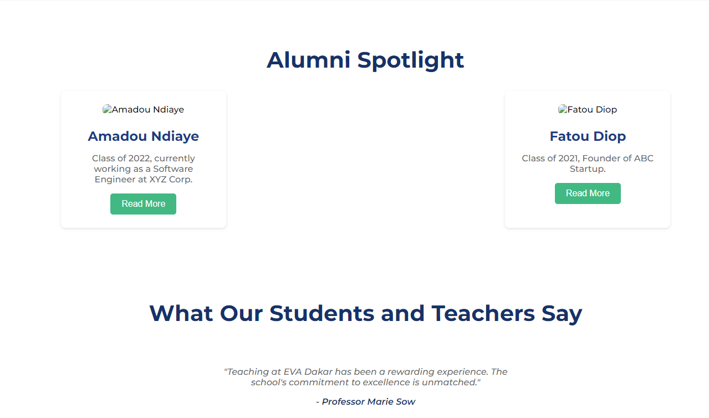

# 🏫 École EVA Dakar Website

A work-in-progress (WIP) website for **École EVA Dakar**, designed and developed by **Kerem SEMIZ** as part of the **SMZ Education** initiative.



Live Deployment: https://keremsemiz.github.io/smz-educationsenegal2/home

## 🌐 Project Overview

This website is built to support **EVA École Dakar**, offering a modern, user-friendly platform to showcase the school’s offerings, values, and more. The site is currently being developed with attention to detail in both design and functionality.

## 🛠️ Built With

- **HTML5**: Provides the structure for the website.
- **CSS3**: Custom styling for a clean, responsive, and visually appealing design.

## 📂 Project Structure

The project is organized into the following folders:

- `.anima`: Contains animations and interactive elements.
- `about`: Includes content for the about page.
- `assets`: Houses images, videos, and other media files used across the website.
- `home`: Contains the main landing page and other home-related content.

## 🚀 Getting Started

To view the project locally:

1. **Clone the repository**:
   ```bash
   git clone https://github.com/keremsemiz/smz-educationsenegal2.git
2. **Navigate to the project folder**:
   ```bash
    cd smz-educationsenegal2
3. **Open the index.html file in your browser to view the home page**:
   ```bash
    open home/index.html

## 🌐 Live Deployment

This website was deployed with Github pages, here is the link: https://keremsemiz.github.io/smz-educationsenegal2/home